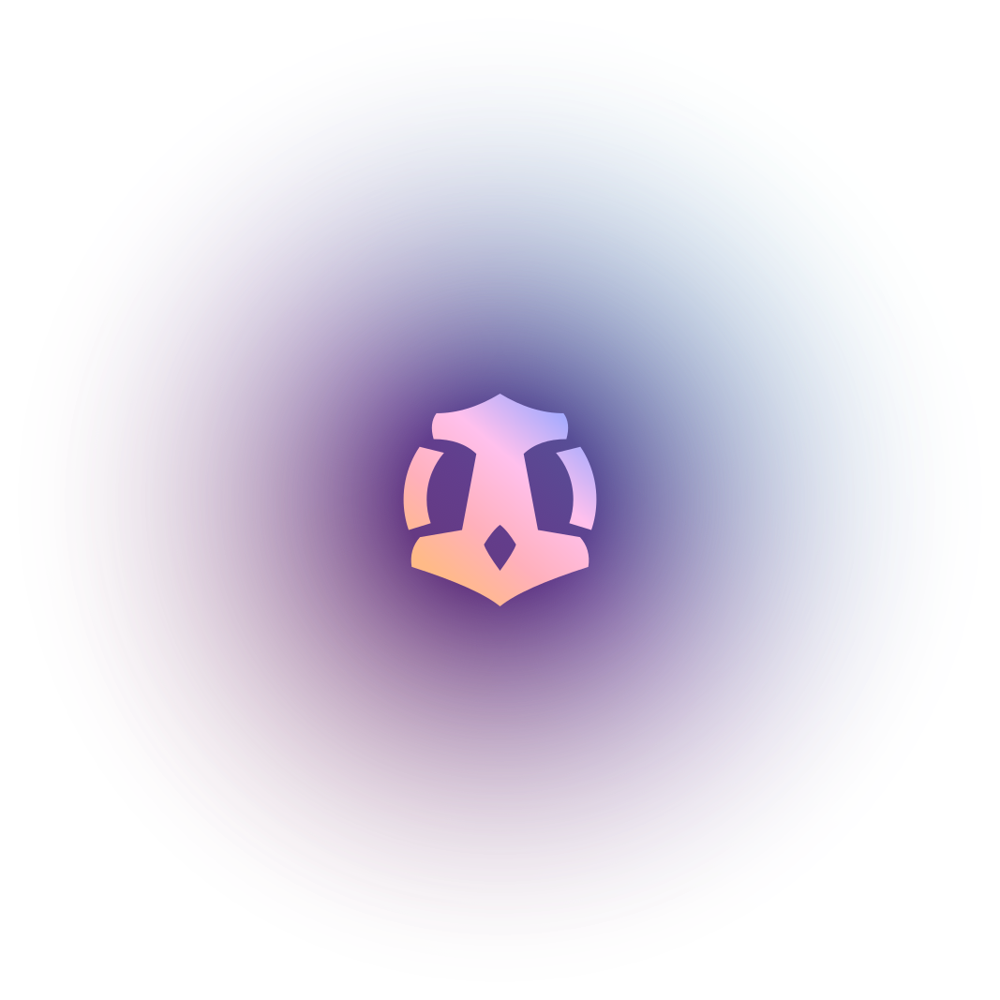
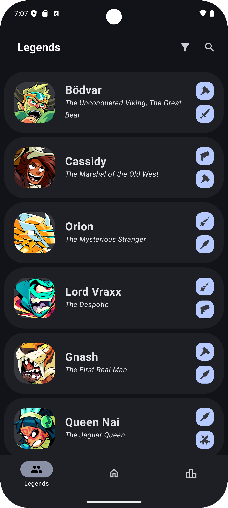
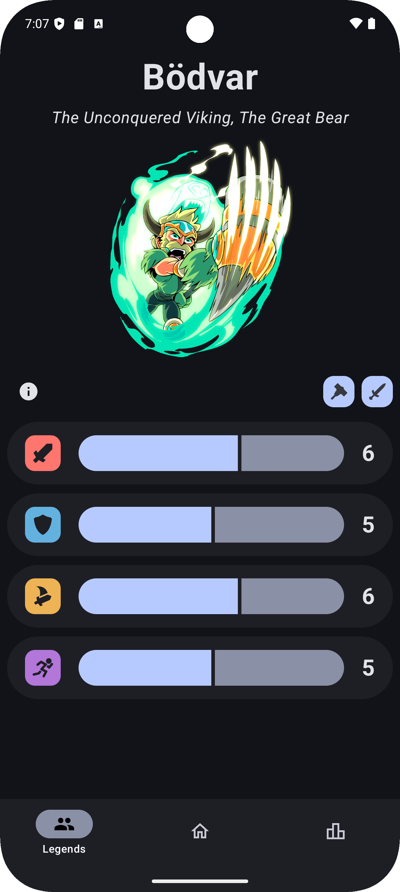
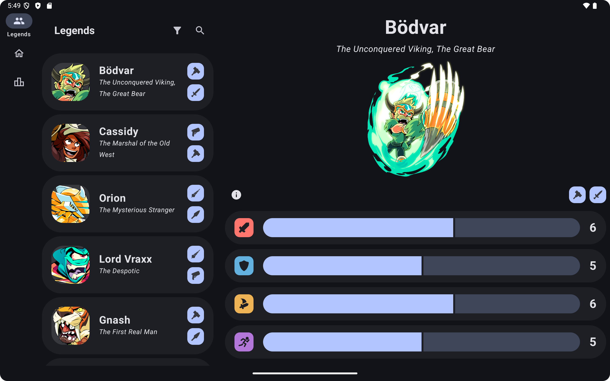
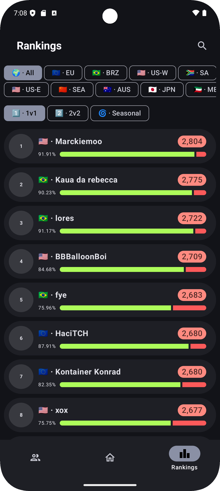
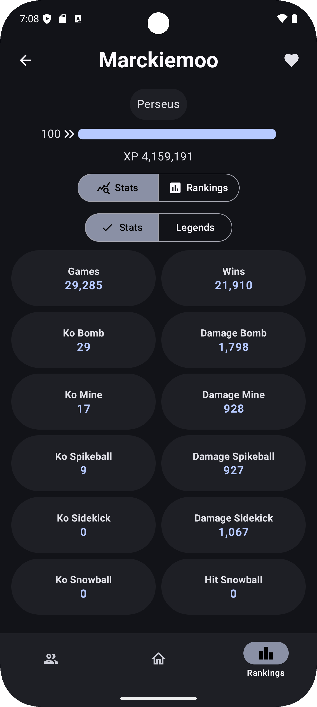
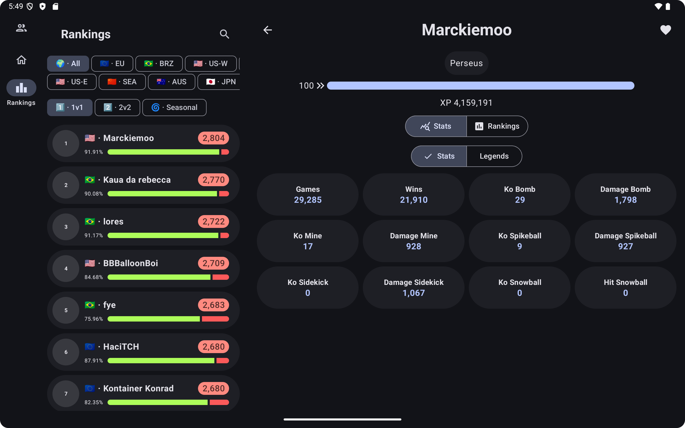

# Brawlhalla Stats

<div align="center">
   
</div>

**Brawlhalla Stats** is an experimental, open-source rewrite of Brawl Tool. This application is
being developed in my free time, and due to my limited computer science knowledge, bugs are to be
expected.

Please note that I will not be updating the older versions available in the Play Store.

## Screens

| Phone list                        | Phone detail                            | Tablet                             |
|-----------------------------------|-----------------------------------------|------------------------------------|
|   |   |   |
|  |  |  |

## Download

<div align="center">
  <div style="display: flex; flex-flow: row wrap; justify-content: center; align-items: center;">
    <a href="https://github.com/ImranR98/Obtainium/releases"></a>
    <a href="https://play.google.com/store/apps/details?id=com.nickoehler.brawlhalla"></a>
  </div>
</div>

## Features

- **Legends Stats and Filters**: View detailed statistics for each legend and apply filters.
- **Rankings**: Access rankings across all available game modes.
- **Player Search**: Search for players by name (only works for those who have played ranked 1v1 in
  the current season).
- **Search by Player ID**: Quickly find players using their unique ID.
- **Comprehensive Player Stats**: View all relevant stats for any player.
- **Clan Information**: Explore clan details and statistics.
- **Favorites**: Mark players and clans as favorites for easy access.
- **Material 3**: Enjoy a clean and intuitive material design interface.
- **Open-Source and Community-Driven**: Join a collaborative effort to enhance the app.

## Contributing

Contributions are highly appreciated! To get involved, please follow these steps:

1. **Fork the Repository**: Click the "Fork" button at the top right of the repository page.
2. **Clone Your Fork**: Use the following command to clone your fork to your local machine:

    ```shell
    git clone git@github.com:YourUsername/Brawlhalla-Stats.git
    ```

3. **Create a New Branch**: Navigate to the project directory and create a new branch for your
   feature or bug fix:

    ```shell
    cd Brawlhalla-Stats
    git checkout -b feature-name
    ```

4. **Request an API Key**: If you want to build the app and access certain features, you will need
   an API key. You can request one by emailing [api@brawlhalla.com](mailto:api@brawlhalla.com).
   However, you can still contribute to the project without it.

5. **Make Your Changes**: Implement your feature or fix the bug.
6. **Commit Your Changes**: Once you're satisfied with your changes, commit them:

    ```shell
    git add .
    git commit -m "Add your commit message here"
    ```

7. **Push to Your Fork**: Push your changes to your forked repository:

    ```shell
    git push origin feature-name
    ```

8. **Create a Pull Request**: Go to the original repository and create a Pull Request to propose
   your changes.

## Acknowledgments

- A heartfelt thank you to the Brawlhalla community for their ongoing support and feedback.
- Special thanks to all contributors who help improve this project.
